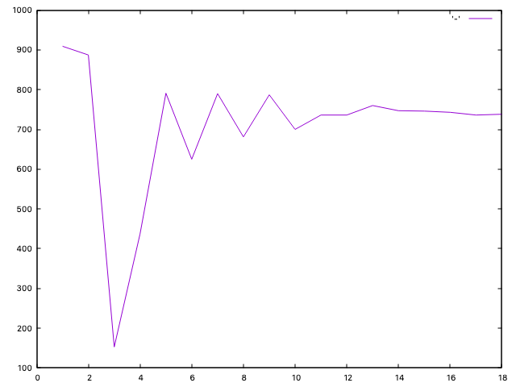

# Guess The Number Project
**C version**


## Table of Contents 
- [Description](#description)
- [Technologies-Used](#Technologies-Used)
- [Installation](#installation)
- [Usage](#usage)
- [Features](#features)


## Description 
An C language implementation of the famous game Guess The Number. The versions of this game show gradual increase in code complexity. The whole project made for educational purposes.
- **version 1** shows a basic programming skills. The user (guesser) should guess the number through several trials with the machine guidance.
- **version 1.1** The guessing now is done by the machine. No user input required.
- **version 2** Structures are introduced. Plotting feature added (Gunplot is called through popen function).
- **version 3** Pointer and pointer to pointers are emerged.
- **version 4** OOP-like approach introduced.The program code is divided into two parts: the Guesser (to guess the number) and the Setter (to set the number and provide guidance the Guesser).
- **version 4.1** The fixed size of the guesses array is replaced by a dynamically allocated memory.
- **version 5.0** The project is restructured to meet maintainability, scalability, and readability for future development.




## Technologies-Used
- C 
- clang 
- gnuplot


## Installation
1. git clone https://github.com/aalmaamari/guess-the-number-C.git
2. cd guess-the-number-C
3. clang -o guess guess-the-number-1.0.0.c


**for version 5:**
1. git clone https://github.com/aalmaamari/guess-the-number-C.git
2. cd guess-the-number-5.0.0
3. make


## Usage
Run the project:
``` bash
./guess
```

**for version 5:**
```
make run
```


## Features
- Simple code.
- Plotting guesses (Gnuplot).
- Machine randomly guessing 
- Pointers, memory management and OOP-like.
